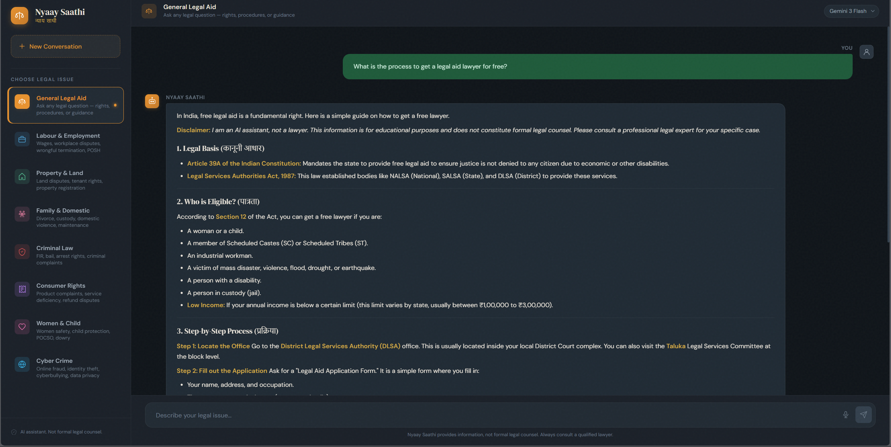
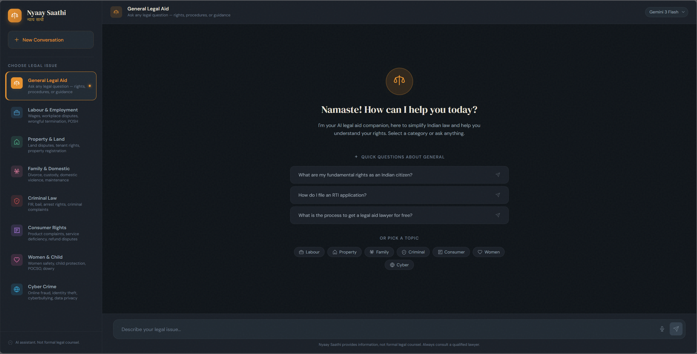
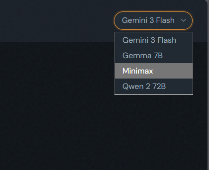

<div align="center">
  <h1>⚖️ Legal Aid Bot</h1>
  <p><i>Democratizing legal knowledge for everyone</i></p>

  
  
</div>

<br />

<div align="center">
  <!-- TODO: Replace with an actual hero screenshot or logo -->
  
</div>

<br />

## 📖 Overview

**Legal Aid Bot** is a full-stack, AI-powered application designed to democratize legal knowledge. It simplifies complex legal information for underprivileged communities, providing accessible, accurate, and easy-to-understand legal assistance. The bot strictly adheres to Indian legal codes and the Constitution, ensuring reliable and localized guidance.

Featuring voice-input capabilities and high-quality realistic text-to-speech, the application is built with accessibility and a premium user experience in mind.

## ✨ Features

- 🎙️ **Voice Interaction:** Seamlessly ask legal questions using voice input.
- 🔊 **Realistic Text-to-Speech:** High-quality voice responses using ElevenLabs integration.
- 🧠 **Advanced AI Models:** Powered by state-of-the-art LLMs (Gemini, OpenRouter) to decode complex legal jargon.
- 🇮🇳 **Localized Legal Knowledge:** Focused on Indian legal codes and the Constitution.
- 🎨 **Premium Aesthetic:** A highly accessible, responsive, and visually appealing user interface.

## 🛠️ Tech Stack

### Frontend


### Backend


### AI & Integrations


## 🚀 Getting Started

### Prerequisites

Ensure you have the following installed on your machine:
- Node.js (v18+)
- Python (v3.10+)
- npm or yarn

### Installation

1. **Clone the repository:**
   ```bash
   git clone https://github.com/yourusername/Legal_Aid_Bot.git
   cd Legal_Aid_Bot
   ```

2. **Setup the Backend:**
   ```bash
   cd backend
   python -m venv venv
   source venv/bin/activate  # On Windows use `venv\Scripts\activate`
   pip install -r requirements.txt
   ```

3. **Setup the Environment Variables:**
   Create a `.env` file in the `backend` directory and add your API keys:
   ```env
   GEMINI_API_KEY=your_gemini_api_key
   OPENROUTER_API_KEY=your_openrouter_api_key
   ELEVENLABS_API_KEY=your_elevenlabs_api_key
   ```

4. **Setup the Frontend:**
   ```bash
   cd ../frontend
   npm install
   ```

### Running the Application

1. **Start the FastAPI Backend:**
   ```bash
   cd backend
   uvicorn main:app --reload
   ```

2. **Start the React Frontend:**
   ```bash
   cd frontend
   npm run dev
   ```

## 📸 Screenshots

<div align="center">
  <!-- TODO: Replace with actual screenshots of your application -->
  
  
</div>

## 🤝 Contributing

Contributions are welcome! Please feel free to submit a Pull Request.

## 📄 License

This project is licensed under the MIT License - see the [LICENSE](LICENSE) file for details.
